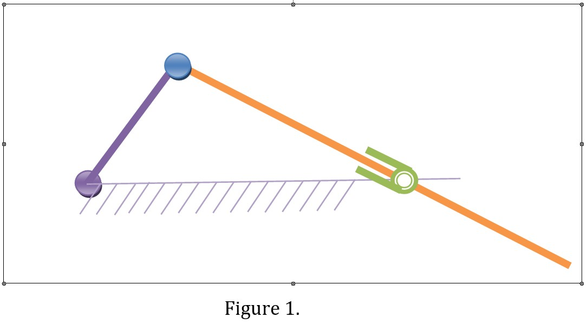
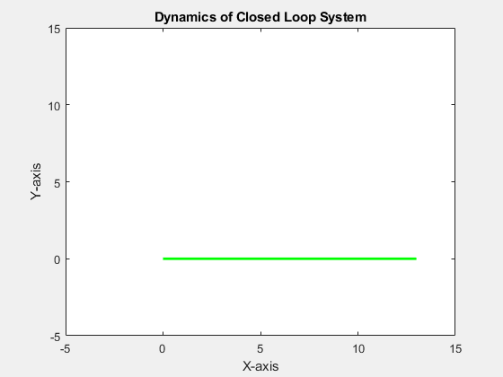

# Dynamics-of-Closed-Loop-System
Dynamics of a closed loop system like slider cranke mechanism and Simulation in MATLAB
# Objectives
1.	Formulate the Inverse and Forward Dynamics of the following closed loop system shown in figure 1.
2.	Write MATLAB code for Inverse and Forward Dynamics of the closed loop system shown in figure 1.

# Outcomes
Inputs: initial crank angle \
        desired crank angle
## case 1: from 0 to 360 degree 

## case 2: from 0 to 90 degree

## case 3: from 0 to 270 degree

